### 基于Cloudera的 Hive+Impala+Hue 集成 Ldap和Sentry 完成认证和授权 

V_1.0

####一. 安装LDAP服务端

1. 安装

		# yum install -y openldap-*

2. 配置

	拷贝ldap配置文件到ldap目录
	
		# cp /usr/share/openldap-servers/slapd.conf.obsolete  /etc/openldap/slapd.conf
	
	创建ldap管理员密码
	
		# slappasswd 
		New password: 
		Re-enter new password: 
		{SSHA}scEXP4oMUugxo9v0hgDpNkoMMDageLuV
	输入保存管理员密码，返回的是加密后的一串密文

	编辑配置文件
		
		# vim /etc/openldap/slapd.conf 

	注：这里组织的域为 bigdata.com，修改对应如下内容my-domain替换为bigdata，rootpw中设置密码：

		# enable server status monitoring (cn=monitor)
		database monitor
		access to *
			by dn.exact="gidNumber=0+uidNumber=0,cn=peercred,cn=external,cn=auth" read
		        by dn.exact="cn=Manager,dc=bigdata,dc=com" read
		        by * none
		
		#######################################################################
		# database definitions
		#######################################################################
		
		database	bdb
		suffix		"dc=bigdata,dc=com"
		checkpoint	1024 15
		rootdn		"cn=Manager,dc=bigdata,dc=com"
		# Cleartext passwords, especially for the rootdn, should
		# be avoided.  See slappasswd(8) and slapd.conf(5) for details.
		# Use of strong authentication encouraged.
		# rootpw		secret
		rootpw		{SSHA}scEXP4oMUugxo9v0hgDpNkoMMDageLuV #加密后的管理员密码

	拷贝DB_CONFIG文件到指定目录

		# cp /usr/share/openldap-servers/DB_CONFIG.example  /var/lib/ldap/DB_CONFIG

	删除默认/etc/openldap/slapd.d下面的所有内容

		# rm -rf /etc/openldap/slapd.d/*

	赋予配置目录相应权限
	
		# chown -R ldap:ldap /var/lib/ldap  
		# chown -R ldap:ldap /etc/openldap/  
		# service slapd start
	生成配置文件并赋值

		# slaptest -f /etc/openldap/slapd.conf -F /etc/openldap/slapd.d
	config file testing succeeded

		# chown -R ldap:ldap /etc/openldap/slapd.d/*
		# service slapd restart

	查看状态，验证服务端口：

		# ps aux | grep slapd | grep -v grep
  		ldap      9225  0.0  0.2 581188 44576 ?        Ssl  15:13   0:00 /usr/sbin/slapd -h ldap:/// -u ldap

		$ netstat -tunlp  | grep :389
		  tcp        0      0 0.0.0.0:389                 0.0.0.0:*                   LISTEN      8510/slapd
		  tcp        0      0 :::389                      :::*                        LISTEN      8510/slapd

	配置开机启动 LDAP 服务：

		chkconfig --add slapd
		chkconfig --level 345 slapd on

3. LDAP 的使用

	导入系统用户
	
	接下来你可以从 /etc/passwd, /etc/shadow, /etc/groups 中生成 ldif 更新 ldap 数据库，这需要用到 migrationtools 工具。
	
	安装：
	
		# yum install migrationtools -y
	利用迁移工具生成模板，先修改默认的配置：
	
		# vim /usr/share/migrationtools/migrate_common.ph
	
		# defalut DNS domain （line 71）
		$DEFAULT_MAIL_DOMAIN = "bigdata.com";
		# defalut base  （line 74）
		$DEFAULT_BASE = "dc=bigdata,dc=com";
	
	生成模板文件：
	
		# /usr/share/migrationtools/migrate_base.pl > /tmp/base.ldif
		然后，可以修改该文件，再执行导入命令：
	
		# ldapadd -x -D "cn=manager,dc=bigdata,dc=com" -W -f /tmp/base.ldif
	
	将当前节点上的用户导入到 ldap 中，可以有选择的导入指定的用户：
	
		先添加用户
		# useradd appuser hive
		查找系统上的 appuser、hive 等用户
		# grep -E "appuser|impala|hue|hive" /etc/passwd  >/tmp/passwd.txt

		转换
		# /usr/share/migrationtools/migrate_passwd.pl /tmp/passwd.txt /tmp/passwd.ldif

		导入
		# ldapadd -D "cn=manager,dc=bigdata,dc=com" -W -f /tmp/passwd.ldif
	
	将用户组导入到 ldap 中：
	
		生成用户组的 ldif 文件，然后导入到 ldap
		# grep -E "appuser|impala|hue|hive" /etc/group  >/tmp/group.txt
		
		转换
		# /usr/share/migrationtools/migrate_group.pl /tmp/group.txt /tmp/group.ldif
		
		导入
		# ldapadd -D "cn=manager,dc=bigdata,dc=com" -W -f /tmp/group.ldif

	查询	

		# ldapsearch -LLL -x -D "cn=manager,dc=bigdata,dc=com" -W -b 'dc=bigdata,dc=com' 'uid=appuser' 
	修改，用户添加好以后，需要给其设定初始密码，运行命令如下：

		# ldappasswd -x -D "cn=manager,dc=bigdata,dc=com" -W "uid=appuser,ou=people,dc=bigdata,dc=com" -S

	删除，删除用户或组条目：
	
		# ldapdelete -x -W -D "cn=manager,dc=bigdata,dc=com" "uid=hive,ou=people,dc=bigdata,dc=com"

4. ldap管理工具 ldapadmin

	下载地址 http://www.ldapadmin.org/download/ldapadmin.html
	
	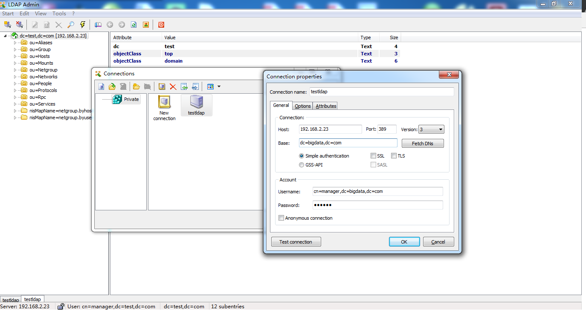 	

	在组中添加用户

	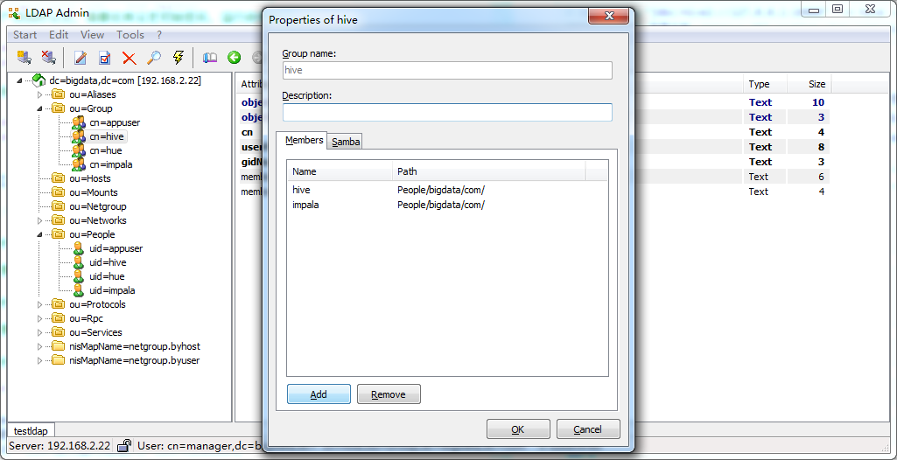 

	为用户设置密码
	
	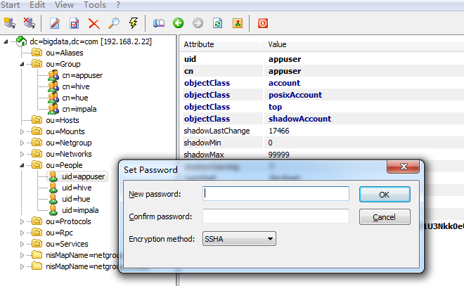 

####二. LDAP认证实现

　　对HUE，impala-shell和beeline都要进行访问认证，所以需要分别在HUE，Impala和Hive中分别实现LDAP的集成。但不管那个系统与LDAP的集成，不外乎都要配置三个基本的属性：1）告诉系统我要与LDAP集成。2） LDAP服务器的地址。3）LDAP的baseDN。

1. LDAP和Hive的集成
	
	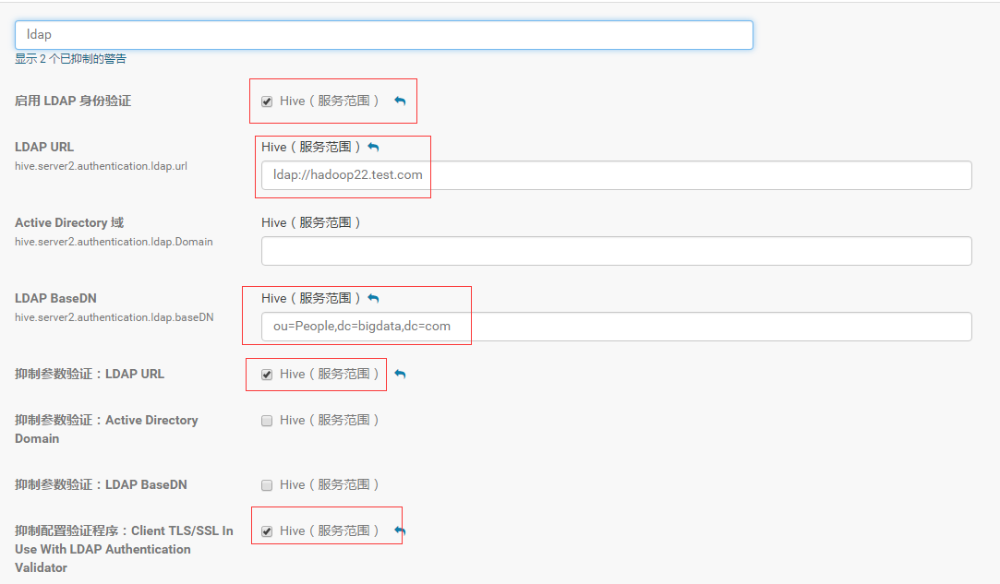

	完成上面的配置后重新启动Hive，配置就生效了，以后如果通过beeline来链接hive，就需要提供用户名和密码了

	

	验证	

		# beeline -u "jdbc:hive2://127.0.0.1:10000" -n hive -p 123qwe
		正确用户和密码，登录成功

		# beeline -u "jdbc:hive2://127.0.0.1:10000" 
		无用户和密码，登录失败，Unknown HS2 problem when communicating with Thrift server.

		# beeline -u "jdbc:hive2://127.0.0.1:10000"  -n hive -p 123456
		错误用户和密码，登录失败，Unknown HS2 problem when communicating with Thrift server.

2. LDAP与Impala的集成

	LDAP和Impala的集成与和Hive的集成非常的类似，除了Hive中提到的3个配置项之外，还需要多配一个配置项（-ldap_passwords_in_clear_ok=true），以告诉Impala密码可以通过明文来传播（如果你的环境中没有配置TSL并且又没有设置这个配置，impala将无法正常启动）

	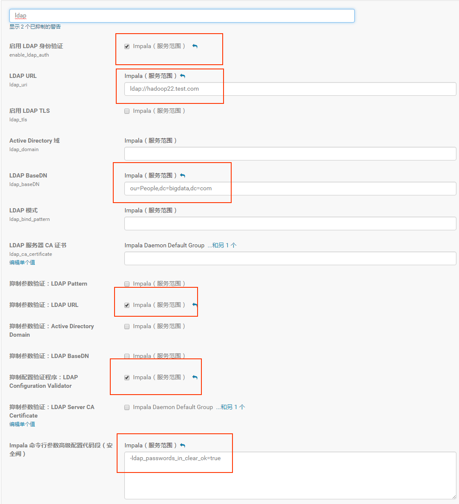 

	验证命令：

		impala-shell -i impalad-server -u impala -l --auth_creds_ok_in_clear
		-i 集群中任意一台impalad服务器都可以
		-u 登录用户
		-l 使用ldap
		--auth_creds_ok_in_clear 由于没有使用ssl，需要添加该参数。

	如果需要免密登录，需要参数 --ldap_password_cmd
		
		impala-shell -i 127.0.0.1 -u impala -l --ldap_password_cmd="echo -n '123qwe'"  --auth_creds_ok_in_clear 

3. LDAP和HUE的集成

	LDAP和HUE的集成依然必须包含那三个关键的要素：告诉HUE要启动LDAP认证，LDAP的Server地址以及baseDN

	告诉Hue使用LDAP来做认证

	backend=desktop.auth.backend.LdapBackend
	
	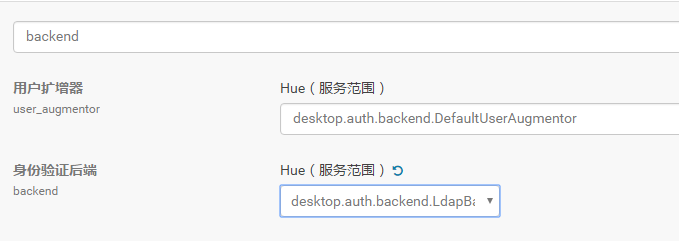 
	
	ldap登陆用户的模板，username运行时被替换

		ldap_username_pattern="uid=<username>,ou=people,dc=bigdata,dc=com"
	
	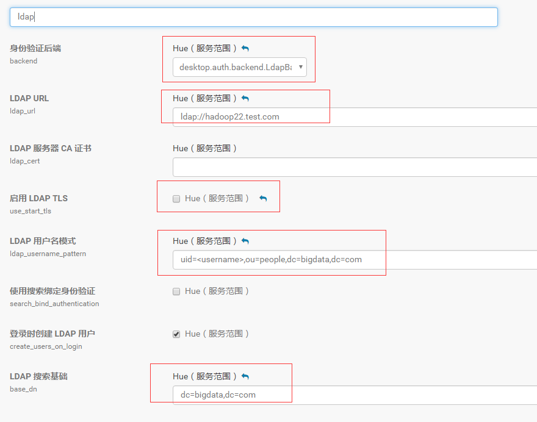 

	其他snippet，用户登录Hue时，需要使用一个预设的用户名和密码去连接hive/impala，连接成功之后，当真正执行QL的时候，还使用登录时的账号来做鉴权。

	hue_safety_valve.ini 的 Hue 服务高级配置代码段（安全阀）中添加以下内容

		[impala]
		impersonation_enabled=true
		auth_username=hue
		auth_password=123qwe
		
		[beeswax]
		close_queries=true
		use_sasl=false
		auth_username=hue
		auth_password=123qwe

	截图如下

	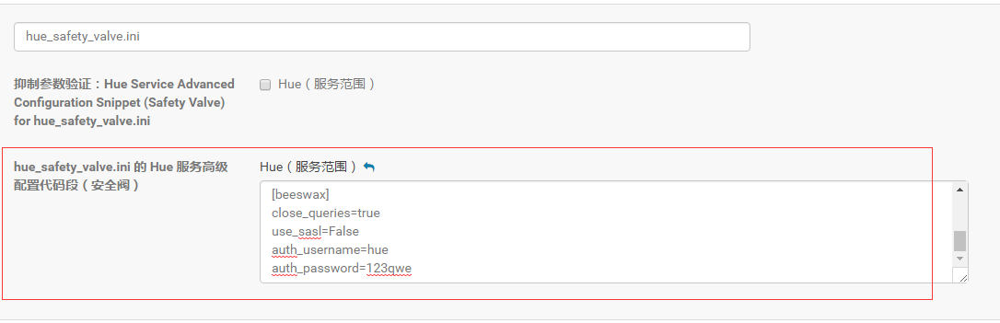 

	如果登录Hue后出现以下错误提示：

		Then you might hit this error:
		
		User 'hue' is not authorized to impersonate 'impala'. User impersonation is disabled.
		This is because Hue is not authorized to be a proxy. To fix it, startup Impala with this flag:
	如图：

	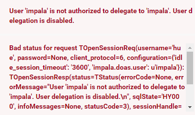 

	需要到impala中配置项“Impala Daemon 命令行参数高级配置代码段（安全阀）”添加参数
		
		--authorized_proxy_user_config=hue=*
	
	如图：

	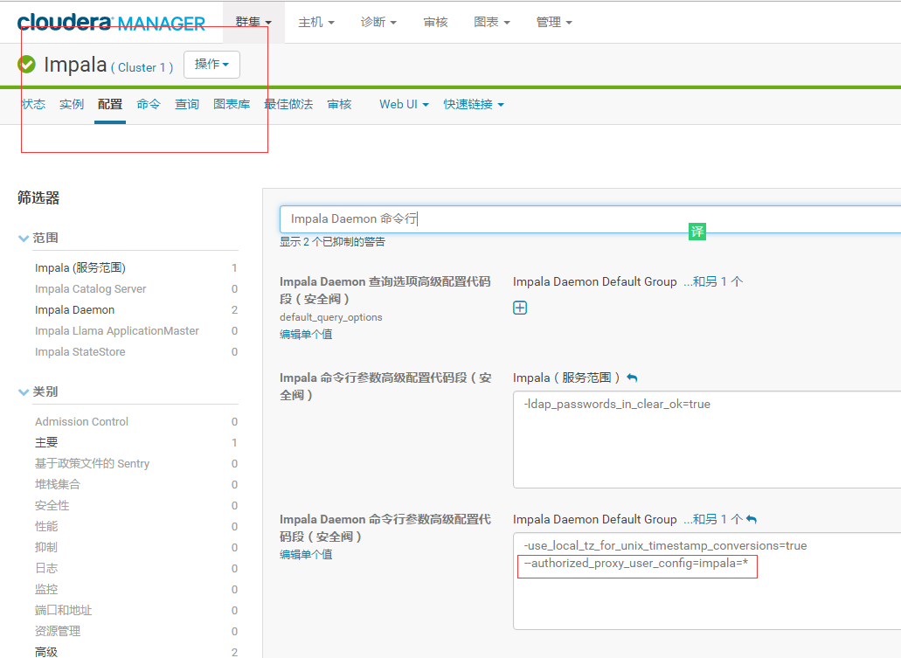 

　　至此，LDAP和HUE，Impala，Hive的整合就完成了。用户访问HUE，Impala以及Hive都需要提供用户名和密码了。

####三. SENTRY授权实现

1. 安装sentry
		
	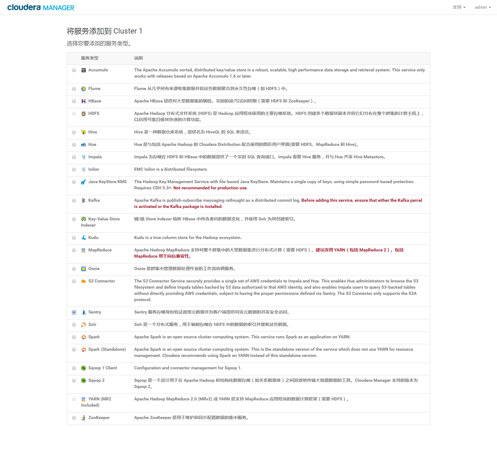 
	
	----
	
	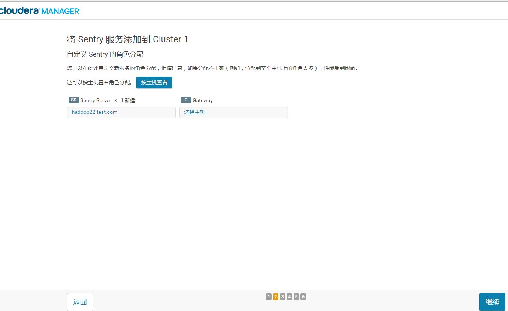 
	
	----
	
	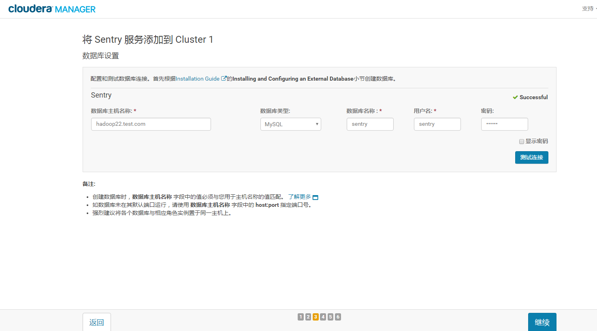 
	
	----
	
	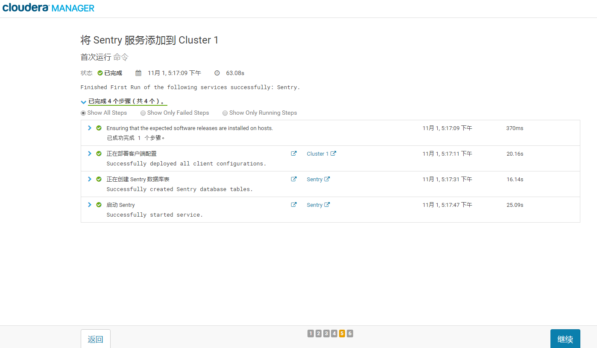 
	
	----
	

2. 配置Sentry服务

	1).设置hive数据仓库目录权限,目前使用的是默认路径
	
		$ sudo -u hdfs hdfs dfs -chmod -R 771 /user/hive/warehouse
		$ sudo -u hdfs hdfs dfs -chown -R hive:hive /user/hive/warehouse

	2) 禁用 HiveServer2 的模拟功能
		 
	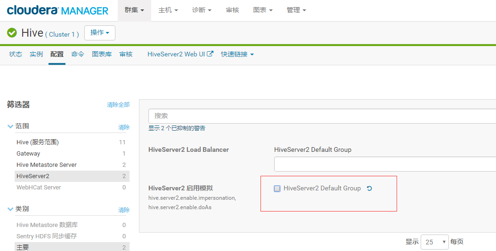 

	3) 在HUE，Hive和Impala中都做如下的配置：

	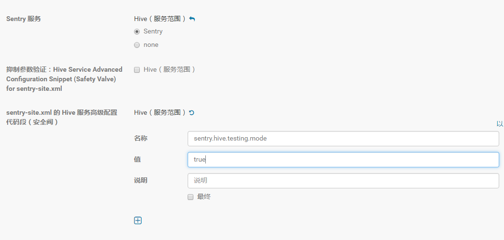 

	这两个配置中，第一个配置告诉系统（hue，hive，impala）要使用sentry来做权限管理
	第二个配置把testing mode设置为true，如果为false，hive会要求必须使用ssl来进行密码传输，我们的环境并没有配置ssl

	4) 配置LDAP组映射
	
		hadoop.security.group.mapping.ldap.url=ldap://hadoop22.test.com
		hadoop.security.group.mapping.ldap.search.filter.user=(&(objectClass=posixAccount)(uid={0}))
		hadoop.security.group.mapping.ldap.search.filter.group=(objectClass=posixGroup)
		hadoop.security.group.mapping.ldap.search.attr.member=memberUid
		hadoop.security.group.mapping.ldap.search.attr.group.name=cn
		hadoop.security.group.mapping.ldap.bind.user=cn=Manager,dc=bigdata,dc=com
		hadoop.security.group.mapping.ldap.bind.password=123qwe
		hadoop.security.group.mapping.ldap.base=dc=bigdata,dc=com
		hadoop.security.group.mapping=org.apache.hadoop.security.LdapGroupsMapping

	如图：

	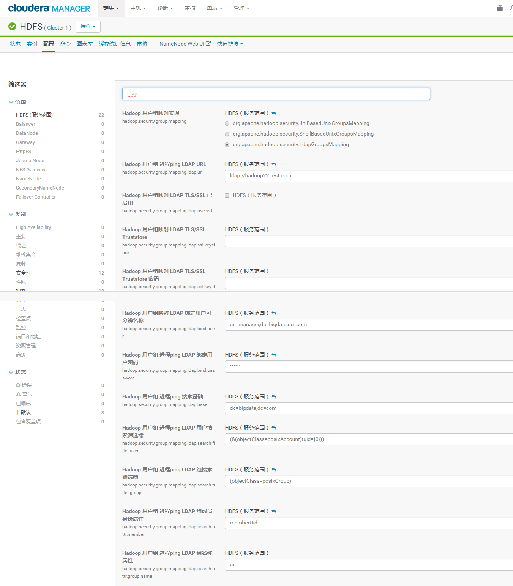 

sentry授权命令

	create role admin_role;
	grant all on server server1 to role admin_role;
	grant role admin_role to group impala;
	
	create database testdb1;
	create database testdb2;
	
    create role test_role;
	grant all on database testdb1 to role test_role;
	grant role test_role to group appuser;
	grant select on database testdb2 to role test_role;
	grant all on uri 'hdfs://hadoop22.test.com:8020/user/appuser/' to role test_role;

####参考文章

	http://blog.csdn.net/u014728303/article/details/53908412

